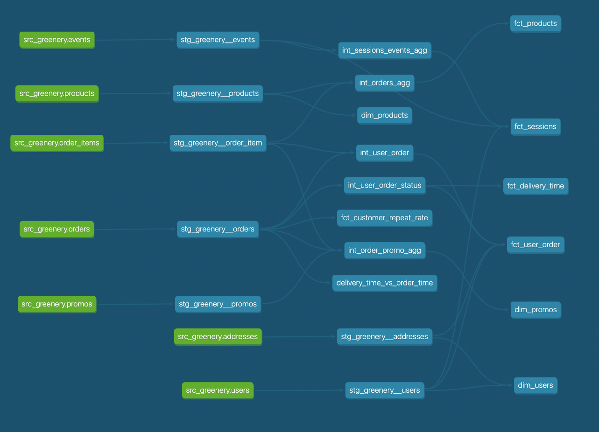

## What is our user repeat rate?

```sql
with orders_cohort as (
    SELECT
        user_guid
        , count(distinct order_guid) as user_orders
    from dbt_eike_r.stg_greenery__orders
    GROUP BY 1
)

, users_bucket as (
    SELECT
        user_guid
        , (user_orders = 1)::int as has_one_purchase
        , (user_orders >= 2)::int as has_two_purchases_or_more
    from orders_cohort
)

SELECT
    sum(has_two_purchases_or_more)::float / count(DISTINCT user_guid) as customer_repeat_rate
from users_bucket
````

> the customer repeat rate is 79.8 %

## Overview about the models with their dependencies:



In the end I was sometimes surprised that some guids were not unique but adjusted my assumptions and tests to the data by either using distinct or dropping the unique from the tests.