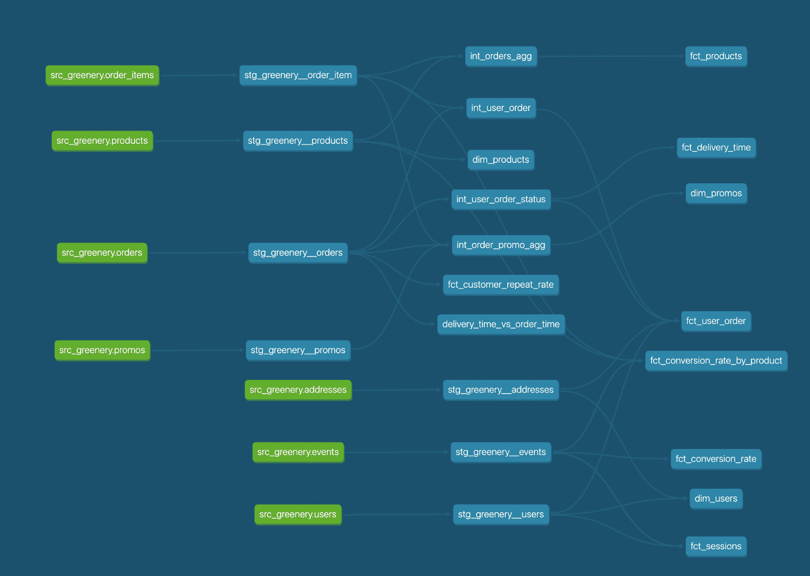

## What is our overall conversion rate?

```sql
WITH event_types AS(
SELECT 
    session_guid
    , MAX(case when event_type = 'checkout' then 1 else 0 end) as checkouts
    , MAX(case when event_type = 'page_view' then 1 else 0 end) as page_views
FROM 
		{{ ref('stg_greenery__events') }}
{{ dbt_utils.group_by(1) }}
)

, agg as (
SELECT
  	sum(event_types.page_views)::float as num_page_views
  	, sum(event_types.checkouts)::float as num_event_checkouts
FROM 
  	event_types
)
SELECT 
    num_event_checkouts
    , num_page_views
    , (num_event_checkouts/num_page_views)::float * 100 as conversion_rate
FROM 
  	agg
```

> 62.46 %

## What is our conversion rate by product?

```sql
with session_events_agg as (
    {{ categorical_counter_agg(agg = "product_guid") }}
)
, product_page_view as(
    SELECT
        session_events_agg.product_guid
        , stg_greenery__products.product_name
        , sum(session_events_agg.page_view) as num_page_view
    from session_events_agg
    left join  {{ ref('stg_greenery__products') }}
        on session_events_agg.product_guid = stg_greenery__products.product_guid
    {{ dbt_utils.group_by(2) }}
)

, product_check_outs as (
    SELECT 
        stg_greenery__order_item.product_guid
        , count(distinct stg_greenery__events.session_guid) as num_checkout
    from {{ ref('stg_greenery__events') }}
    left join {{ ref('stg_greenery__order_item') }}
        on stg_greenery__order_item.order_guid = stg_greenery__events.order_guid
    where stg_greenery__events.event_type = 'checkout'
    {{ dbt_utils.group_by(1) }}
)

SELECT
    product_page_view.product_guid
    , product_page_view.product_name
    , product_page_view.num_page_view
    , product_check_outs.num_checkout
    , ROUND(product_check_outs.num_checkout::numeric / product_page_view.num_page_view::numeric * 100, 2) AS product_conversion_rate
from product_page_view
LEFT JOIN product_check_outs
    on product_check_outs.product_guid = product_page_view.product_guid

```

> Between 32% and  60%

## Create a macro to simplify part of a model

```sql


    
   
        SELECT
        session_guid
        
        , sum(case when event_type = {{ event_type }} then 1 else 0 end) as {{ event_type.replace("'", '"') }}
        
        from {{ ref('stg_greenery__events') }}
        {{ dbt_utils.group_by(1) }}
    
        SELECT
        session_guid
        , {{ agg }}
        
        , sum(case when event_type = {{ event_type }} then 1 else 0 end) as {{ event_type.replace("'", '"') }}
        
        from {{ ref('stg_greenery__events') }}
        {{ dbt_utils.group_by(2) }}
          

```
> I created this macro and made one of my intermediate models redundant.

## Image of the DAG

